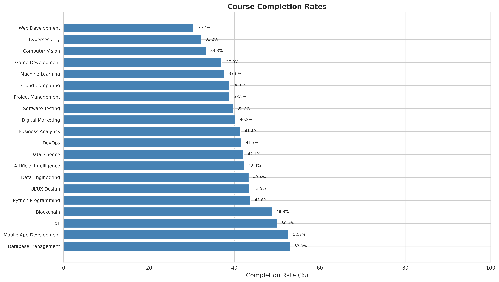
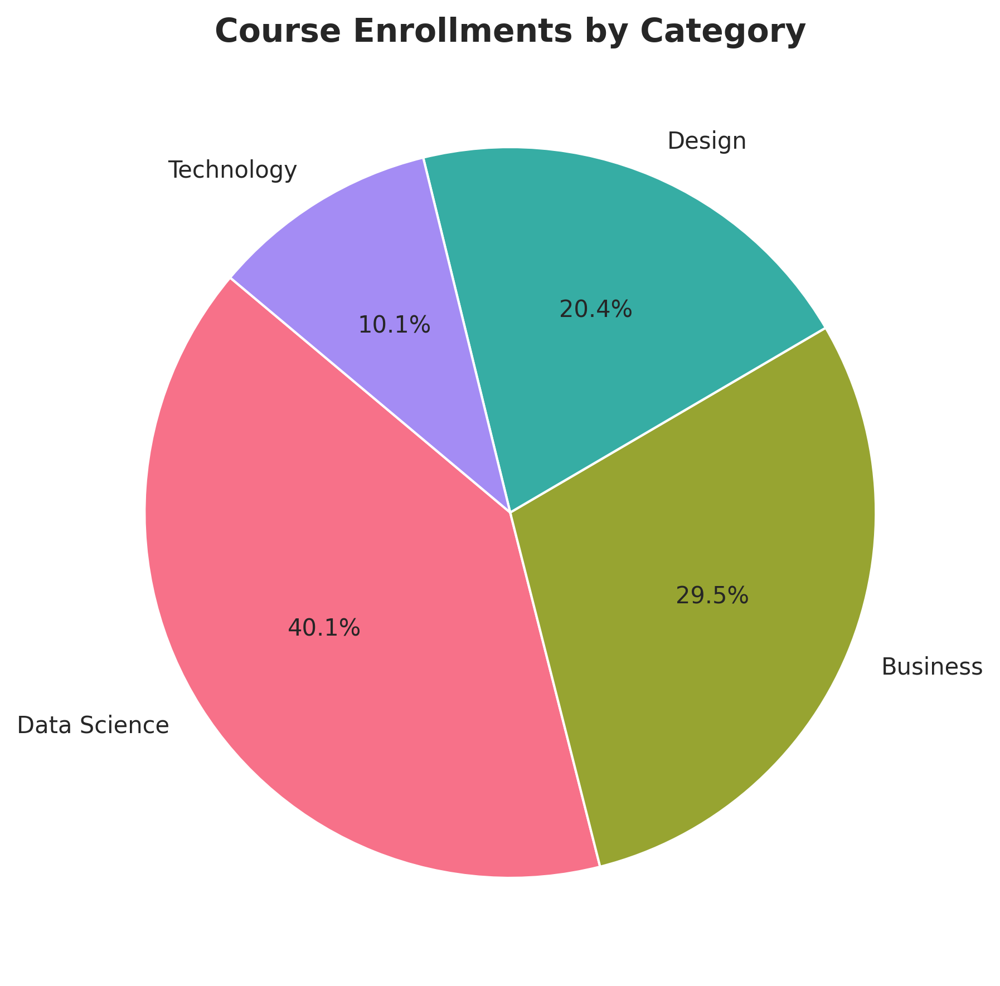
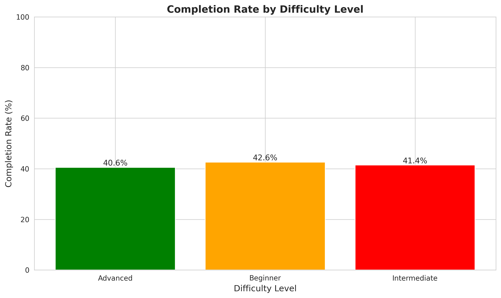
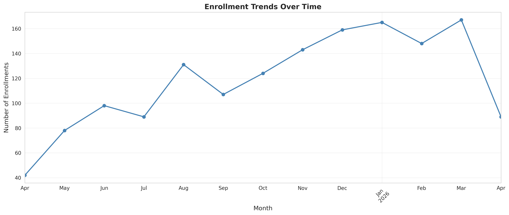
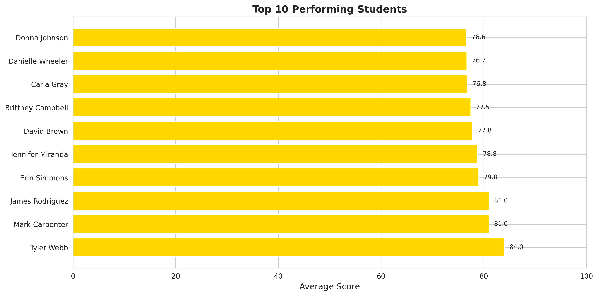
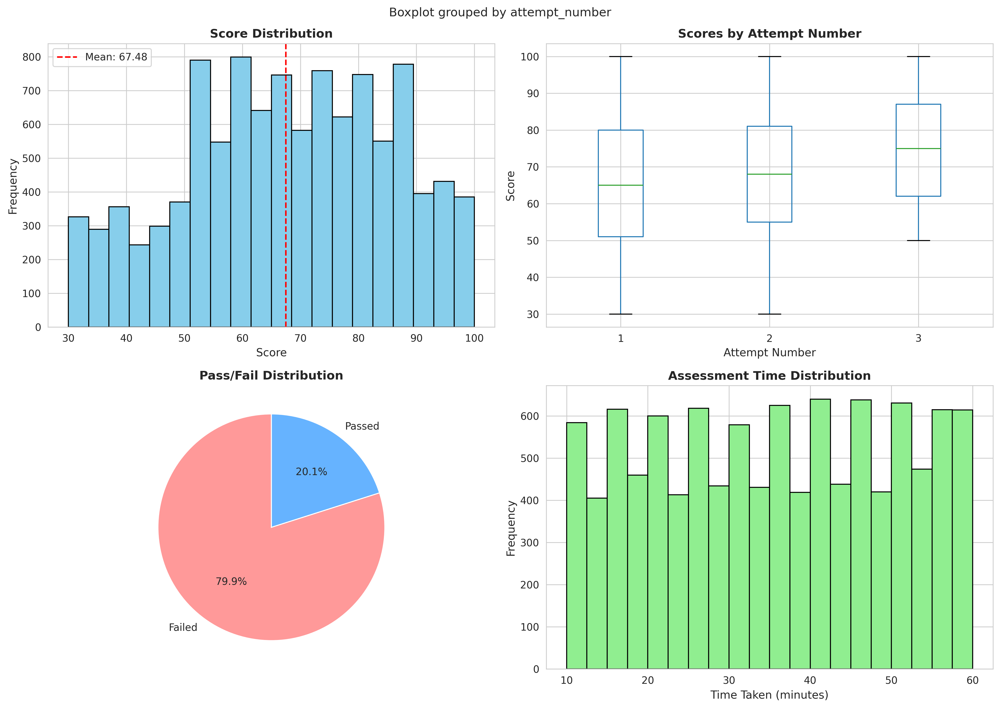
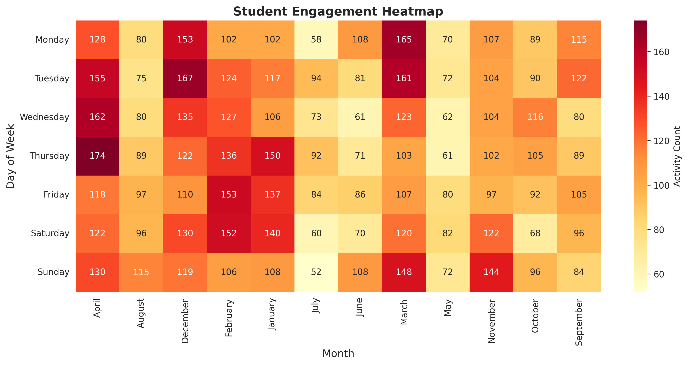
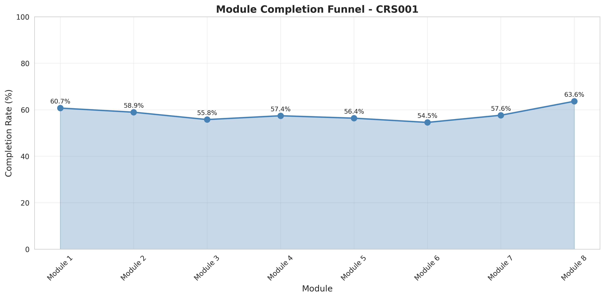

# E-Learning Progress Tracker

> A comprehensive **Big Data Analytics** system for tracking and analyzing student progress in online learning platforms — powered by **Apache Hadoop, HDFS, Apache Spark, and PySpark**.

---

## Table of Contents

- [Overview](#-overview)
- [Architecture](#-architecture)
- [Features](#-features)
- [Technology Stack](#-technology-stack)
- [Project Structure](#-project-structure)
- [Installation & Setup](#-installation--setup)
- [Usage](#-usage)
- [Analytics & Results](#-analytics--results)
- [Visualizations](#-visualizations)
- [Troubleshooting](#-troubleshooting)
- [Learning Outcomes](#-learning-outcomes)

---

## Overview

The **E-Learning Progress Tracker** is a full-scale data engineering and analytics project that simulates a real-world online learning platform. It ingests synthetic educational data, stores it in HDFS, and processes it with Apache Spark to deliver actionable insights across three analytical domains:

| Domain | What It Answers |
|---|---|
| **Course Analytics** | Which courses have the best completion rates? Where do students drop off? |
| **Student Performance** | Who are the top performers? Which students are at risk? |
| **Predictive Analytics** | Who is likely to struggle? What courses should a student take next? |

The project runs in **local mode** (no Hadoop required) or in **full HDFS + YARN mode** for true distributed processing.

---

## Architecture

```
┌─────────────────────────────────────────────────────────────────┐
│                        DATA PIPELINE                            │
│                                                                 │
│  ┌──────────────┐    ┌──────────────┐    ┌──────────────────┐   │
│  │ Data         │    │ HDFS Storage │    │ Apache Spark     │   │
│  │ Generator    │───▶│ (Optional)   │───▶│ Processing       │   │
│  │ (Faker/CSV)  │    │ /user/       │    │ (PySpark DFs)    │   │
│  └──────────────┘    │  elearning/  │    └────────┬─────────┘   │
│                      └──────────────┘             │             │
│                                                   ▼             │
│              ┌────────────────────────────────────────────┐     │
│              │            Analytics Modules               │     │
│              │  ┌──────────┐ ┌──────────┐ ┌───────────┐   │     │
│              │  │  Course  │ │ Student  │ │Predictive │   │     │
│              │  │Analytics │ │Performan.│ │ Analytics │   │     │
│              │  └──────────┘ └──────────┘ └───────────┘   │     │
│              └────────────────────┬───────────────────────┘     │
│                                   ▼                             │
│              ┌────────────────────────────────────────────┐     │
│              │     Results: CSV Reports + Visualizations  │     │
│              └────────────────────────────────────────────┘     │
└─────────────────────────────────────────────────────────────────┘
```

---

## Features

### 1. Synthetic Data Generation
- Generates realistic datasets using the **Faker** library
- 500 students, 20 courses, 8 modules per course (fully configurable)
- Covers: students, courses, modules, enrollments, progress records, and assessments

### 2. HDFS Integration
- Full HDFS directory setup and file upload via `hdfs dfs` commands
- Graceful local-mode fallback when HDFS is unavailable
- HDFS health monitoring and disk usage reporting

### 3. Course Analytics (`course_analytics.py`)
- Course completion & drop rate analysis
- Most and least popular courses by enrollment
- Module-level completion tracking and bottleneck detection
- Average time to complete vs. expected duration
- Difficulty-level vs. completion rate correlation

### 4. Student Performance Analytics (`student_performance.py`)
- Individual performance metrics across enrollments, modules, and assessments
- **Top 10 performer** identification via composite scoring
- **At-risk student** detection with High / Medium / Low risk levels
- Engagement analysis by day of week and month
- Assessment score distribution and perfect score tracking

### 5. Predictive Analytics (`predictive_analysis.py`)
- Course completion likelihood prediction (High / Medium / Low)
- Early struggling student identification from first-3-module signals
- Personalized course recommendations based on performance history
- Study time prediction and variance against expected duration

### 6. Visualization Dashboard (`visualization.py`)
- 8 auto-generated publication-quality PNG charts
- Covers: completion rates, enrollment trends, performance distribution, engagement heatmaps, top performers, and more

---

## Technology Stack

| Layer | Technology |
|---|---|
| **Language** | Python 3.x |
| **Distributed Storage** | Apache Hadoop 3.3+ / HDFS |
| **Distributed Processing** | Apache Spark 3.5+ / PySpark |
| **Data Manipulation** | Pandas |
| **Synthetic Data** | Faker |
| **Visualizations** | Matplotlib, Seaborn |
| **Resource Management** | Apache YARN (optional) |

---

## Installation & Setup

### Prerequisites

**1. Java 8+** (required for Hadoop & Spark)
```bash
sudo apt install default-jdk -y
java -version
```

**2. Apache Hadoop 3.3+** *(only needed for HDFS mode)*
```bash
wget https://dlcdn.apache.org/hadoop/common/hadoop-3.3.6/hadoop-3.3.6.tar.gz
tar -xzvf hadoop-3.3.6.tar.gz
sudo mv hadoop-3.3.6 /opt/hadoop
echo 'export HADOOP_HOME=/opt/hadoop' >> ~/.bashrc
echo 'export PATH=$PATH:$HADOOP_HOME/bin:$HADOOP_HOME/sbin' >> ~/.bashrc
echo 'export JAVA_HOME=/usr/lib/jvm/default-java' >> ~/.bashrc
source ~/.bashrc
```

**3. Apache Spark 3.5+**
```bash
wget https://dlcdn.apache.org/spark/spark-3.5.0/spark-3.5.0-bin-hadoop3.tar.gz
tar -xzvf spark-3.5.0-bin-hadoop3.tar.gz
sudo mv spark-3.5.0-bin-hadoop3 /opt/spark
echo 'export SPARK_HOME=/opt/spark' >> ~/.bashrc
echo 'export PATH=$PATH:$SPARK_HOME/bin' >> ~/.bashrc
source ~/.bashrc
```

**4. Python Dependencies**
```bash
python3 -m venv venv
source venv/bin/activate
pip install -r requirements.txt
```

### HDFS Configuration *(Optional)*

```bash
# Format HDFS (first time only)
hdfs namenode -format

# Start services
start-dfs.sh
start-yarn.sh

# Verify (should show NameNode, DataNode, ResourceManager, NodeManager)
jps
```

Web UIs after startup:
- **HDFS NameNode:** http://localhost:9870
- **YARN ResourceManager:** http://localhost:8088

---

## Usage

###  Run Full Pipeline — Local Mode (No Hadoop Required)
```bash
python run_project.py
```

###  Run Full Pipeline — With HDFS
```bash
python run_project.py --hdfs
```

###  Run Individual Modules
```bash
python data_generation.py       # Step 1: Generate CSV data
python hdfs_operations.py       # Step 2: Upload to HDFS
python course_analytics.py      # Step 3: Course-level analysis
python student_performance.py   # Step 4: Student performance analysis
python predictive_analysis.py   # Step 5: Predictions & recommendations
python visualization.py         # Step 6: Generate all charts
```

### Pipeline Steps (automated in `run_project.py`)

| Step | Module | Description |
|------|--------|-------------|
| 1 | `data_generation.py` | Generate 500 students, 20 courses, and all related records |
| 2 | `hdfs_operations.py` | Create HDFS directories & upload CSVs (skipped in local mode) |
| 3 | `spark_utils.py` | Initialize Spark session with optimized configuration |
| 4 | `spark_utils.py` | Load all datasets into Spark DataFrames |
| 5 | `course_analytics.py` | Run full course analytics suite & save CSVs |
| 6 | `student_performance.py` | Run full student analytics suite & save CSVs |
| 7 | `predictive_analysis.py` | Run predictive models & save CSVs |
| 8 | `visualization.py` | Generate and save all 8 charts |
| 9 | Cleanup | Stop Spark session gracefully |

---

## Analytics & Results

### At-Risk Student Detection Logic

Students are flagged using a multi-criteria rule engine applied in `student_performance.py`:

```
High Risk   →  completion_rate < 30%  AND  avg_score < 50
Medium Risk →  completion_rate < 50%  OR   avg_score < 60
Low Risk    →  dropped_courses > 2    OR   module_completion_rate < 40%
```

### Top Performer Composite Score

```
performance_score = (completion_rate       × 0.4)
                  + (module_completion_rate × 0.3)
                  + (avg_assessment_score   × 0.3)
```

### Course Completion Prediction (Early Signals)

| Prediction | Criteria |
|---|---|
| **High** | progress_ratio ≥ 25% AND completion_ratio ≥ 70% AND avg_time > 2h |
| **Medium** | progress_ratio ≥ 15% AND completion_ratio ≥ 50% |
| **Low** | Below medium thresholds |

### Personalized Course Recommendations

| Avg Assessment Score | Recommended Difficulty |
|---|---|
| ≥ 80 | Advanced, Intermediate |
| 60–79 | Intermediate, Beginner |
| < 60 | Beginner only |

---

## Visualizations

All charts are automatically generated and saved to `data/results/visualizations/`.

---

### Course Completion Rates

Horizontal bar chart ranking all 20 courses by completion rate. **Database Management** (53.0%) and **Mobile App Development** (52.7%) lead, while **Web Development** (30.4%) and **Cybersecurity** (32.2%) have the most room for improvement.



---

### Course Enrollments by Category

**Data Science** dominates with 40.1% of all enrollments, followed by **Business** (29.5%), **Design** (20.4%), and **Technology** (10.1%).



---

### Completion Rate by Difficulty Level

All three difficulty levels show closely clustered completion rates (**Advanced: 40.6%**, **Beginner: 42.6%**, **Intermediate: 41.4%**), suggesting that motivation and engagement — not course difficulty — are the primary drivers of drop-off.



---

### Enrollment Trends Over Time

Enrollments grew steadily from ~40/month (April 2025) to a peak of ~165/month (January 2026), with notable seasonal dips in July and September consistent with summer and early-term patterns.



---

### Top 10 Performing Students

**Tyler Webb** leads with an average assessment score of **84.0**, followed by **Mark Carpenter** and **James Rodriguez** (both 81.0). All top-10 performers scored above 76.



---

### Student Performance Distribution

Four-panel view showing: score histogram (mean: **67.48**), scores by attempt number (scores improve on later attempts), pass/fail ratio (only **20.1% pass rate** — a critical concern for platform quality), and uniformly distributed assessment durations (10–60 minutes).



---

### Student Engagement Heatmap

Activity is consistent across all days of the week. Peak engagement occurs on **Thursdays in April** (174 activities) and **Tuesdays in December** (167), suggesting academic calendar effects. July shows the lowest overall engagement across all days.



---

### Module Completion Funnel — CRS001 (Python Programming)

Completion rates are relatively stable across all 8 modules (54–64%), with the lowest point at **Module 6 (54.5%)**. A recovery to **63.6%** at Module 8 suggests that students who persist through the middle modules tend to finish the course.



---

## Troubleshooting

**HDFS port conflict:**
```bash
sudo lsof -i :9870
kill -9 <PID>
```

**HDFS permission denied:**
```bash
hdfs dfs -chmod -R 777 /user/elearning
```

**Spark out of memory — edit `$SPARK_HOME/conf/spark-defaults.conf`:**
```
spark.driver.memory    4g
spark.executor.memory  4g
```

**Hadoop services not running:**
```bash
jps   # Should show: NameNode, DataNode, ResourceManager, NodeManager
stop-all.sh && start-all.sh
```

**Local CSV loading issues:**
The `SparkDataLoader` automatically prefixes paths with `file://` to force local filesystem reads regardless of the configured HDFS default. No manual intervention needed.

---
